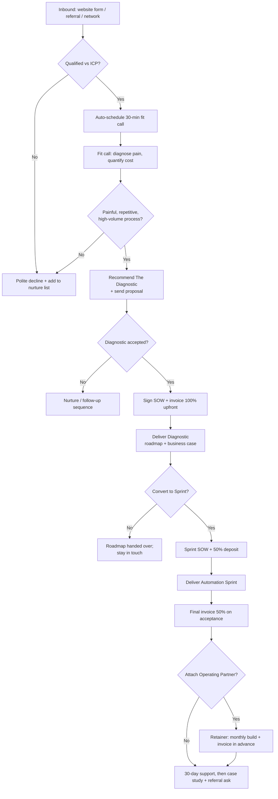
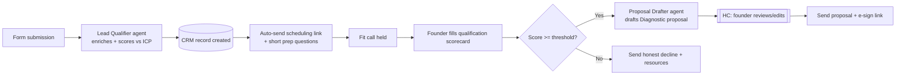
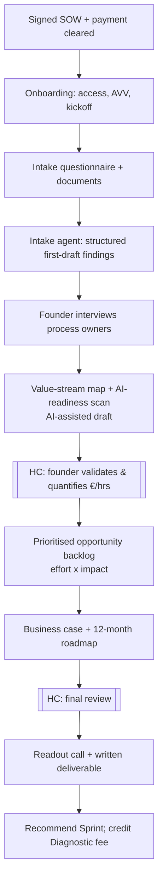
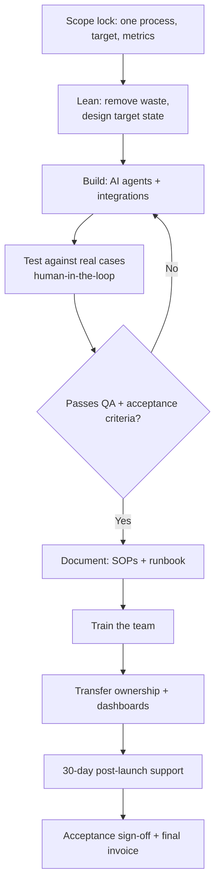
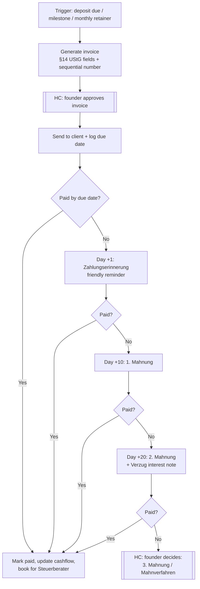
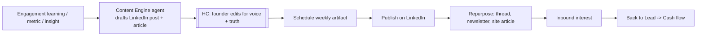
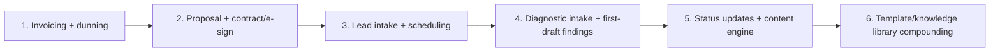

# Lean-AI — Business Process Flows

*The end-to-end flows that run the company — with human-in-the-loop checkpoints marked.*

These diagrams render automatically on GitHub. They describe how work moves through Lean-AI from first contact to cash and renewal. Each flow notes where a **human checkpoint (HC)** is mandatory — Lean-AI automates the drudgery but a human always reviews client-facing output and anything touching money or client data.

Related: `60-internal-automation-blueprint.md` (architecture), `62-ai-agent-prompt-library.md` (the agents), `workflows/` (importable n8n templates).

---

## 1. Lead → Cash (the master flow)

**Human checkpoints:** fit call (HC), proposal review (HC), all deliverable sign-offs (HC), case-study approval (HC).

---

## 2. Fit-call & qualification flow

---

## 3. Diagnostic delivery flow

---

## 4. Automation Sprint delivery flow

---

## 5. Invoicing & dunning flow (the "automatic invoice" process)

**Rule:** never start build work before the relevant deposit clears (see `../finance/50-invoicing-process.md`). The reminder/Mahnung cadence is automatable; the escalation at the end is always a human decision.

---

## 6. Content / authority engine flow

---

## 7. Internal build order (what to automate first)

Given the 10–15 hr/week budget, automate in this order — each step buys back time to build the next:

> Principle: Lean-AI runs on the exact systems it sells. Every internal automation is also a live demo and a case study.

